

Please **`submit the form below with your Attendee or pod ID`**. All configuration entries in the lab guide will be renamed to include your pod ID.
{: .block-warning }

<form id="attendee-form">
  <label for="attendee">Attendee ID:</label>
  <input type="text" id="attendee" name="attendee" onChange="update()"> 
 
  <button onclick="update()">Save</button>
</form>

 

# Lab 5: Intelligent Routing

## Introduction

This lab guide provides step-by-step instructions for configuring a skills-based routing system in Webex Contact Center. It utilizes AutoCSAT predictions to enhance customer service operations.

By following these steps, participants will learn how to direct customer inquiries to the agent most likely to provide the highest level of customer satisfaction, thereby improving both customer satisfaction and agent efficiency.

## Lab Objective

The objective is to improve customer service operations by integrating AutoCSAT predictions into the routing configuration. The goal is to increase overall customer satisfaction and agent efficiency by routing inquiries to the most qualified agent.

**Scenario**

> A telecommunications company's customer service department handles a high volume of billing-related inquiries. The company has implemented skills-based routing to ensure customers with technical issues related to internet connectivity connect with specialized agents.

- This is by generating CSAT scores for calls automatically using the new AutoCSAT feature.
- We will use custom logic inside of the Flow to route calls that have a low CSAT score associated (by fetching it via the Auto CSAT API) and routing them to an agent with a HighCX Skill set. (Higher Profiency)

## Configuration

**Queues:**

- `CL_Q_`<w class = "attendee_out">attendeeID</w> where `attendeeID` is your assigned pod number.

**Skills Definition:**

- Languages: English and Spanish
- Customer Service (Proficiency): High (10), Medium (5), Low (1)

**Skills Profile:**

> We will create profiles for each Customer Service Representative (CSR) indicating their language skills and customer service proficiency levels.

### Step 1: Create Skills-Based Queue

- Navigate to Control Hub > Contact Center > Customer Experience.
- Click on 'Queue' and then 'Create Queue'.

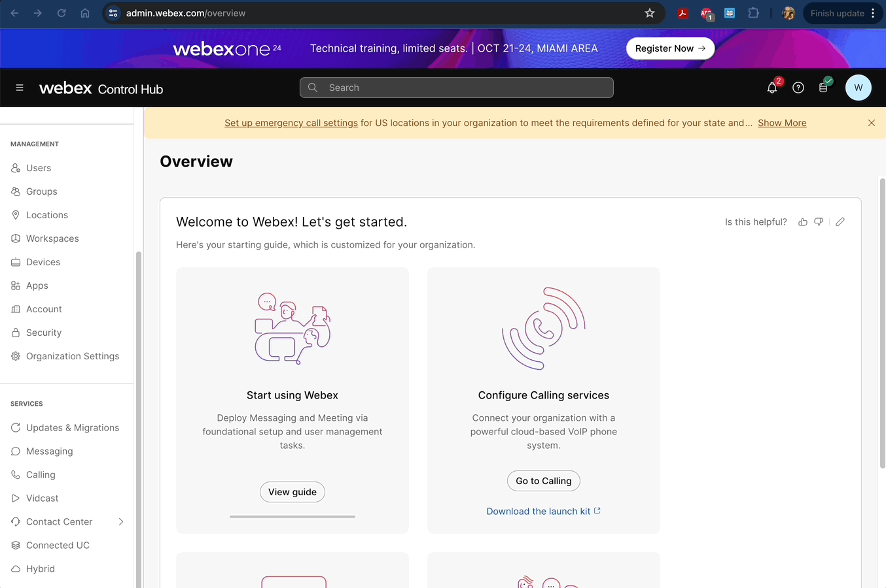  
 
 

- Name the queue `CL_Q_SBR_`<w class = "attendee_out">attendeeID</w> where `attendeeID` is your assigned pod number.

- Leave the Queue Type as 'Inbound Queue' and select 'Telephony' for Channel Type.
- In Contact Routing Settings, select 'Skill Based' for Queue Routing Type.
- In Call Distribution, create and save a group for the CL_Team_attendeeID where attendeeID is your pod number.

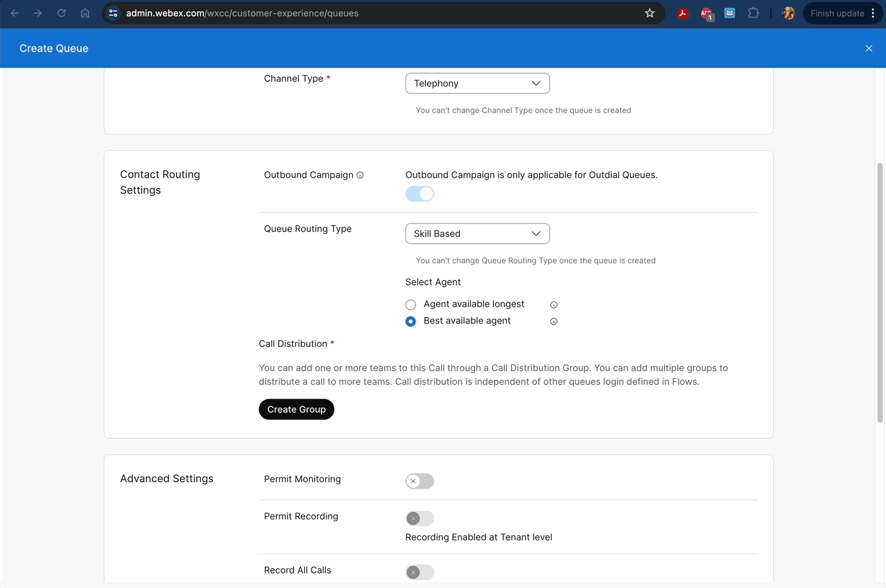  
 
 

- In Advanced Settings, enable 'Permit Monitoring' and 'Pause/Resume'.
- Set the Service Level Threshold to 30 seconds and Maximum Time in Queue to 86400 seconds.
- Select the default music (`defaultmusic_on_hold.wav`) for the queue and click 'Create'.

### Step 2: Verify Skill Definition

Verify that two Skill Definitions as shown below:

**Language Skill Definition:**

- Go to User Management > Skill Definitions > Search for the `Lang_SD` Skill.
- It is of Type Enum with values for English and Spanish.

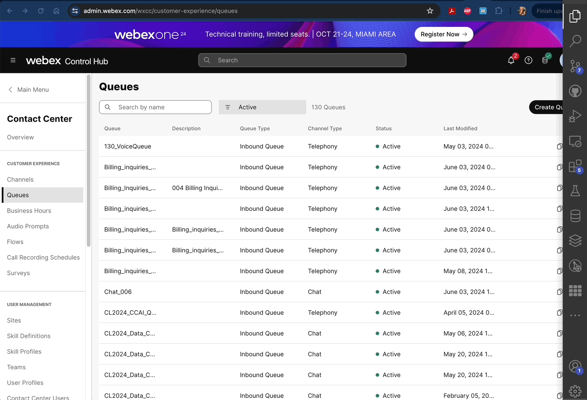  
 
 

**Customer Service Skill Definition:**

- Search for the `CustomerService_SD` Skill.
- It is of Type Proficiency with values from 1 to 10.

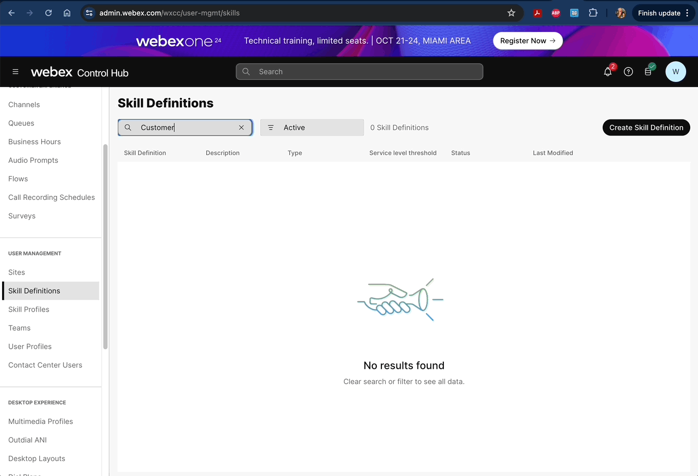  
 
 

### Step 3: Create Skill Profile

Verify the two skill profiles based on language proficiency:

**Skill Profile HighCX (English + High Customer Service)**

- Under User Management > Skill Profiles > Search for the Skill Profile named `HighCX`.
- This has the `Lang_SD` skill with English and `CustomerService_SD` skill with New and 10 proficiency.

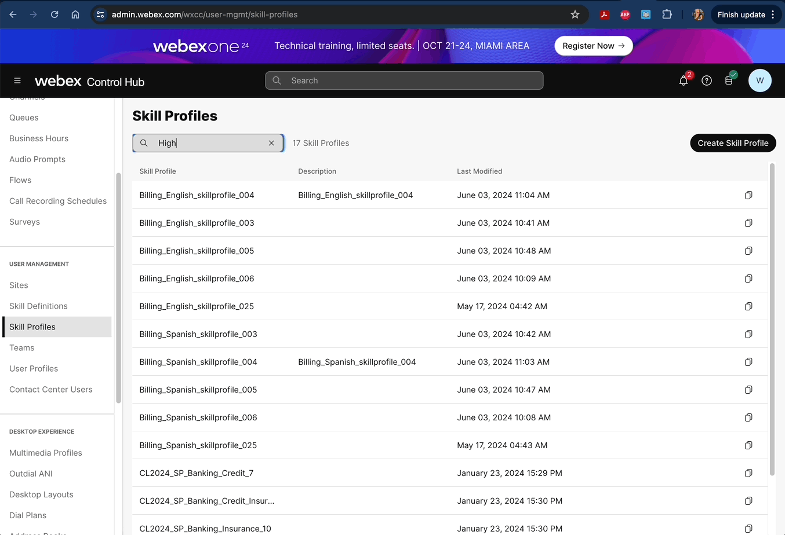  
 
 

**Skill Profile LowCX (Spanish + Low Customer Service)**

- Verify there is another profile named `LowCX`.
- It has the `Lang_SD` skill with English and `CustomerService_SD` skill with New and 2 proficiency.

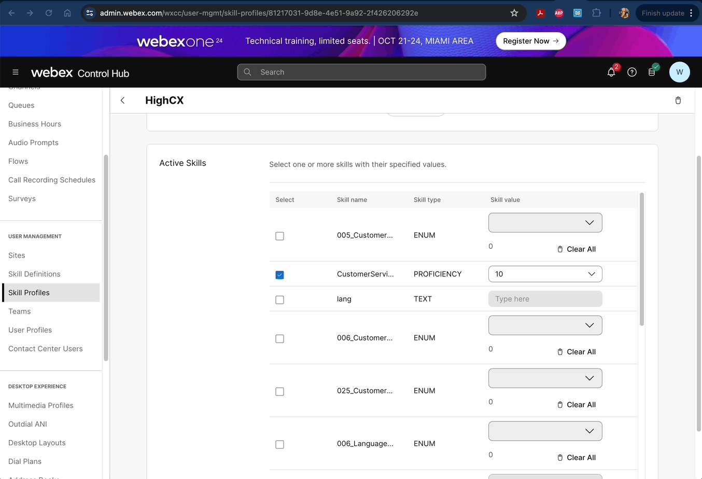  
 
 

### Step 4: Assign Skill Profile

Assign the created skill profiles to agents in the Billing Team:

- Agent 1: Skill Profile HighCX
- Users > User Management > wxcclabs+agentIDattendeeID@gmail.com where attendeeID is your pod number > Skill Profile.

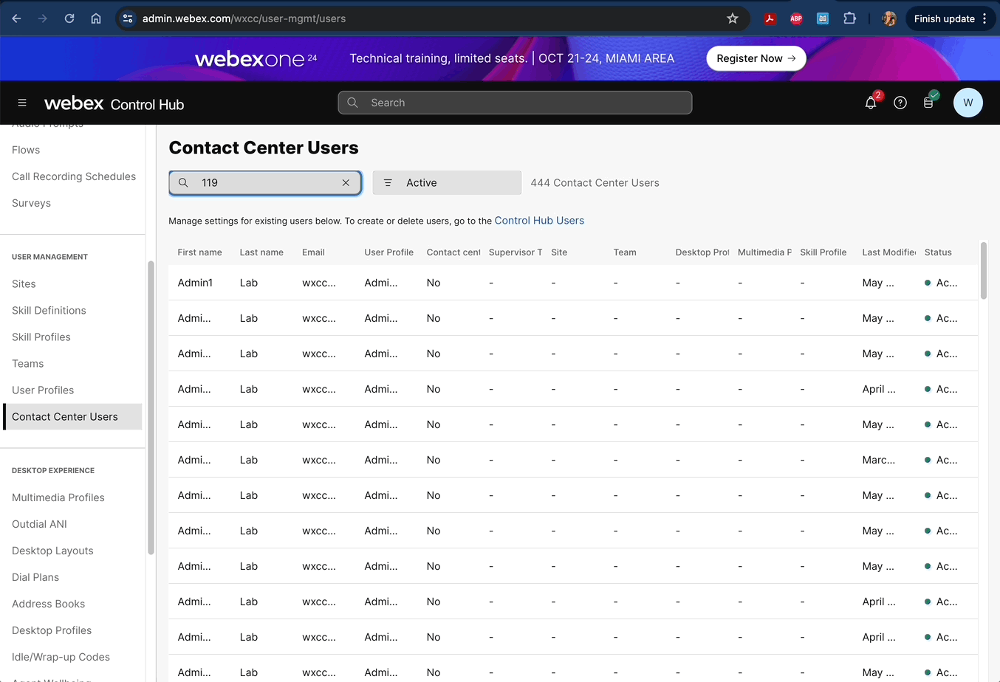  
 
 

- Supervisor: Skill Profile LowCX.

> **Note that for the supervisor to login to the desktop, you will need to assign the Site, Team, and other configurations.**

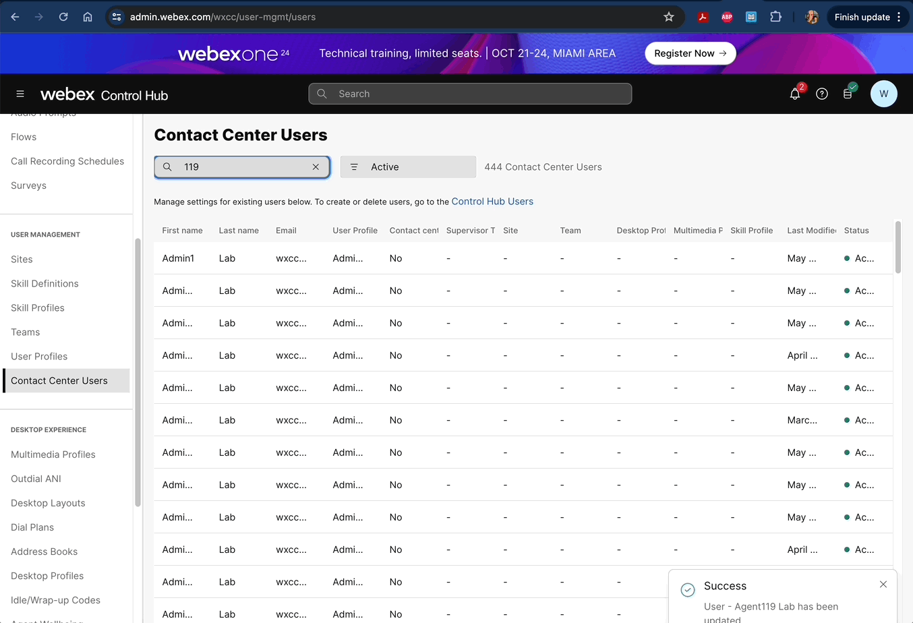  
 
 

### Step 5: Configure the Voice Flow

- Access Customer Experience > Flows and copy the existing flow `Auto_CSAT_Routing` flow.

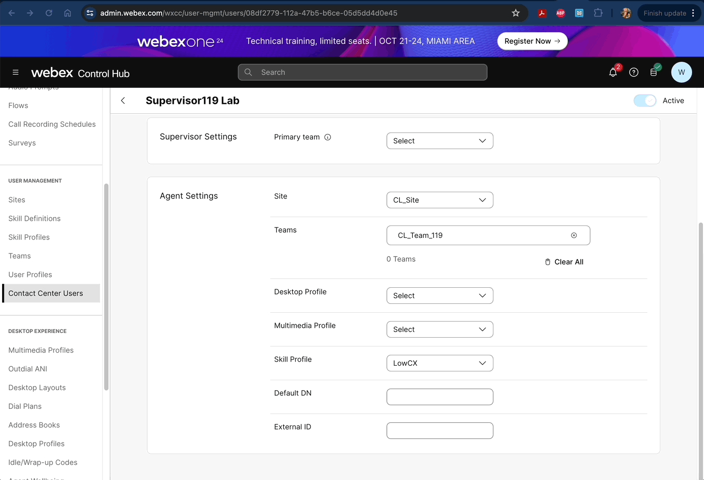  
 
 

- Rename the flow to Auto_CSAT_Routing_attendeeID where attendeeID is your pod number.

- Verify the flow and available for AutoCSAT, current time, and a three-day lookback - `autoCsat`, `currentTime`, `goback_by_3days`

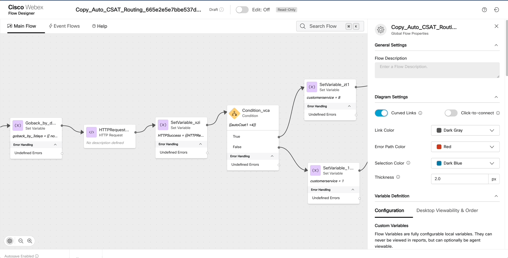  
 
 

- Configure the HTTP node with the correct OrgID and Authorization Token - `please see the steps below`

**How to do this**

- Open the developer portal > Go to the documentation > Search API

- Open another tab and go the link: https://developer.webex-cx.com/documentation/search/v1/search-tasks and login using the Admin Credentials.

- Once logged in > click Try Out > Copy the Authorization Token.

  
 
 

- Go back to the flow and replace the Authorization Bearer Token with the one you copied. Just replace the Bearer token, leaving the Bearer keyword as it is.

> **Note - To Copy the token, you need to sign in on the top right**

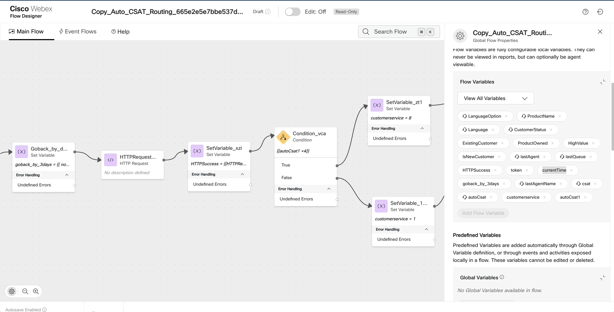  
 
 

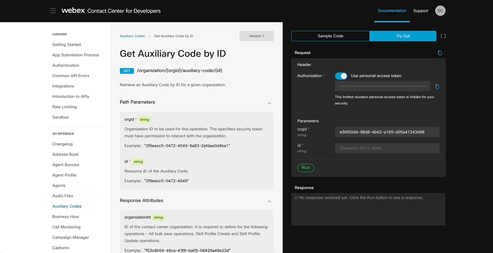  
 
 

- Set up skill value assignments in the queuecontact Node.
- In the Queue Contact Activity, we will assign the skill value to each contact while placing the caller in the queue.

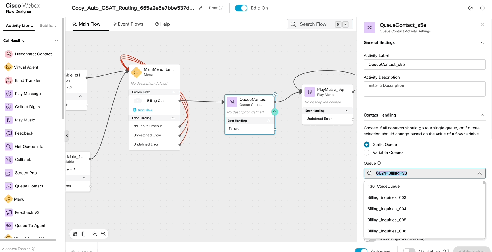  
 
 

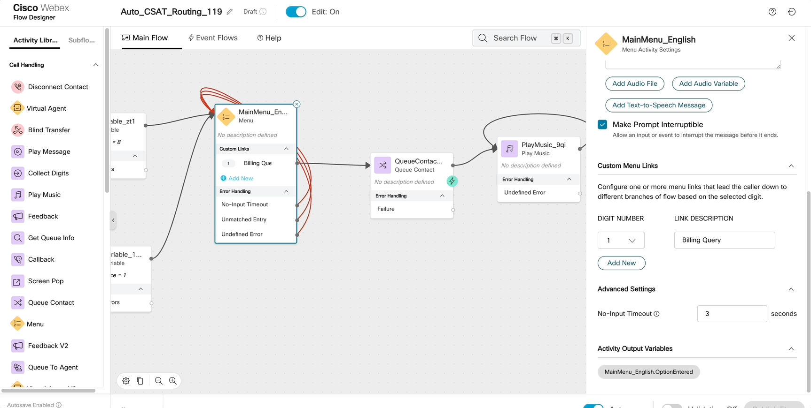  
 
 

> **Note: As of now, the Token is not refreshed automatically and hence the step is needed for testing.**

> The feature is planned and will be released shortly where the token will be refreshed automatically by the flow. Refer: [Whats New in Webex Contact Center](https://help.webex.com/en-us/article/nv7abhz/What's-new-for-administrators-in-Webex-Contact-Center#topic_D8159C942D4EE10D3C86F7C043C86722)

- Go through all the settings of the HTTP node, which is invoking the “Search API” and parsing it through the response to store the relevant fields in the flow variable.

- Depending on the response, we will check the value and depending on the condition, we will set the variable “customerservice” accordingly. For e.g. if the AutoCSAT is <4 then the CustomerService Skills requirement is >8 otherwise, its greater than 1.

### Step 6: Update the Entry Point with the changes

- In the Control Hub, under Customer Experience > Channels, search for your EP using CL_EP_attendeeID

- Update the Flow to use Auto_CSAT_Routing_attendeeID and the Latest Version.

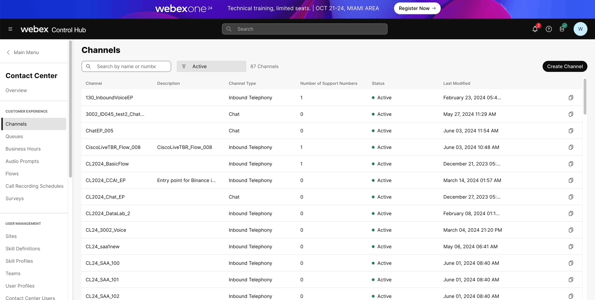  
 
 

### Step 7: Verify the Call Flow

- Test the call routing by placing calls to the Entry Point and ensuring that calls are correctly routed based on the configured skills.

- You can do this by logging in an agent and a supervisor into different chrome profiles and testing skills based routing based on what the API returns.

**Congratulations! You just completed the lab!**

> Feel free to reach out to the proctors for any questions or clarifications.
